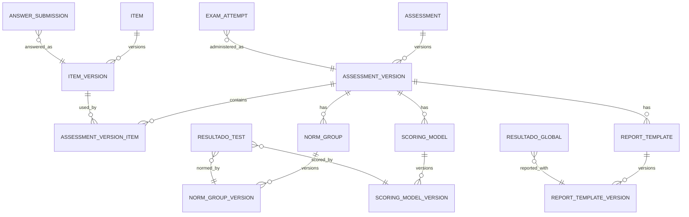

# Psychometric Governance Platform

## Objetivo

Esta fase convierte Integrity Test en una base preparada para gobernar científicamente instrumentos de evaluación. No cambia algoritmos, no crea pruebas nuevas y no modifica dashboards.

## Diagrama de Relaciones



## Versionado Formal

- `Assessment` identifica la prueba lógica.
- `AssessmentVersion` congela una versión publicable de la prueba.
- `Item` identifica el reactivo lógico.
- `ItemVersion` congela contenido, llave, idioma, etiquetas y parámetros editoriales.

Una versión publicada no debe editarse. Los servicios bloquean mutaciones de versiones `PUBLISHED` o `ACTIVE`; el cambio correcto es crear una nueva versión.

## Workflow Editorial

Estados preparados:

- `DRAFT`
- `INTERNAL_REVIEW`
- `PSYCHOLOGIST_REVIEW`
- `APPROVED`
- `PUBLISHED`
- `RETIRED`

Para reactivos operativos se soporta además:

- `DRAFT`
- `REVIEW`
- `PILOT`
- `ACTIVE`
- `RETIRED`

## Reglas Fase 4.2

- Una versión `PUBLISHED` o `ACTIVE` es inmutable.
- Para cambiar contenido, parámetros, baremos, scoring o plantilla se debe crear una nueva versión.
- No se puede publicar desde `DRAFT`; la ruta válida es `DRAFT -> INTERNAL_REVIEW -> PSYCHOLOGIST_REVIEW -> APPROVED -> PUBLISHED`.
- Retirar una versión requiere `retirementReason`.
- El flujo real de evaluación solo resuelve `AssessmentVersion` publicada para nuevos intentos.
- La sesión solo devuelve `ItemVersion` `ACTIVE` o `PUBLISHED`.
- Scoring, baremos y plantillas solo se resuelven si están `PUBLISHED`; si no existen, el resultado queda marcado por `governanceTrace` como parcial o legacy.

## Protección DB

La migración `20260702060000_add_psychometric_publication_immutability` agrega:

- `retirement_reason` en tablas de versiones.
- función `prevent_published_version_mutation()`.
- triggers en:
  - `assessment_versions`
  - `item_versions`
  - `norm_group_versions`
  - `scoring_model_versions`
  - `report_template_versions`

Los triggers bloquean updates sobre versiones `PUBLISHED`/`ACTIVE`, salvo retiro controlado con razón.

## Banco Profesional de Reactivos

La infraestructura soporta:

- categorías
- competencias
- escalas
- subescalas
- exposición
- dificultad
- discriminación
- tiempo esperado
- idioma
- etiquetas

No se implementó calibración nueva ni modelos IRT nuevos.

## Gobierno de Baremos

- `NormGroup` define la población normativa vinculada a una versión de prueba.
- `NormGroupVersion` versiona tabla normativa, población, muestra y vigencia.

Esto permite saber qué baremo exacto se usó para un resultado.

## Modelos de Scoring

- `ScoringModel` define el modelo lógico.
- `ScoringModelVersion` versiona algoritmo configurado y parámetros.

No se reemplaza el motor actual; solo se prepara la referencia auditable.

## Reportes

- `ReportTemplate`
- `ReportTemplateVersion`
- `ReportIssueRecord`

Cada reporte emitido puede registrar la plantilla usada y una `governanceTrace`.

## Trazabilidad Científica

Un resultado puede responder:

- versión de prueba: `ExamAttempt.assessmentVersionId`
- versión de reactivos: `AnswerSubmission.itemVersionId`
- versión de baremo: `ResultadoTest.normGroupVersionId` / `ResultadoGlobal.normGroupVersionId`
- versión de scoring: `ResultadoTest.scoringModelVersionId` / `ResultadoGlobal.scoringModelVersionId`
- versión de plantilla: `ResultadoGlobal.reportTemplateVersionId` / `ReportIssueRecord.reportTemplateVersionId`

## Decisiones

- Se agregaron columnas opcionales para no romper datos existentes.
- No se migró automáticamente `Question`/`Exam` hacia `Item`/`Assessment`.
- Se preserva el motor actual.
- Se centraliza la inmutabilidad en servicios internos, no en triggers SQL todavía.

## Deuda Restante

- Backfill formal desde `Exam`/`Question` hacia `Assessment`/`Item`: disponible en `npm run backfill:psychometric-governance`.
- UI editorial para psicóloga/evaluador.
- Aprobación dual y firma de cambios científicos.
- Estudios psicométricos formales, calibración y análisis de calidad por versión.
- Completar plantillas editoriales reales; la conexión básica a `ReportIssueRecord` ya existe cuando hay `ReportTemplateVersion` publicada.

## Backfill Fase 4.1

El script `prisma/backfill-psychometric-governance.ts` mapea:

- `Exam` -> `Assessment`
- `Exam.isPublished` -> `AssessmentVersion` publicada
- `Question` -> `Item`
- `Question` usada por examen -> `ItemVersion`
- `ExamQuestion` -> `AssessmentVersionItem`

También crea artefactos `legacy-current` para `ScoringModelVersion`, `NormGroupVersion` y `ReportTemplateVersion` sin cambiar el cálculo existente.

Ejecutar:

```bash
npm run backfill:psychometric-governance
```
